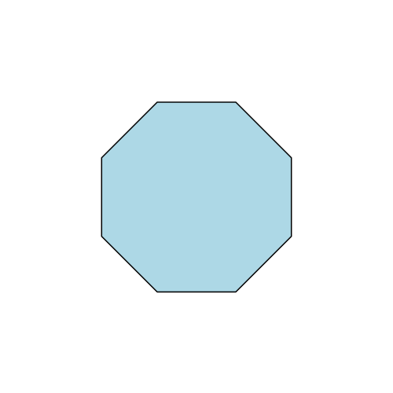
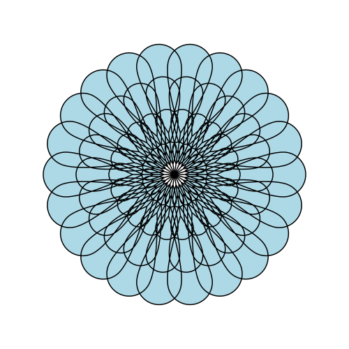
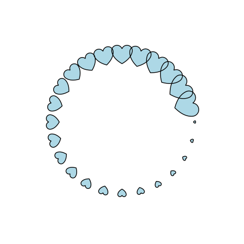
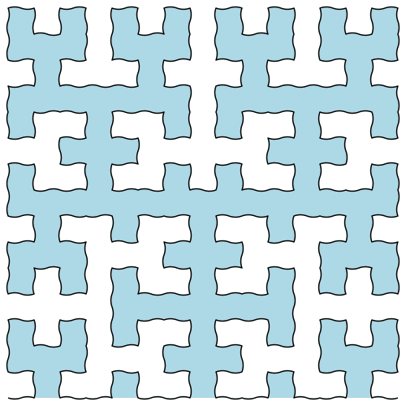
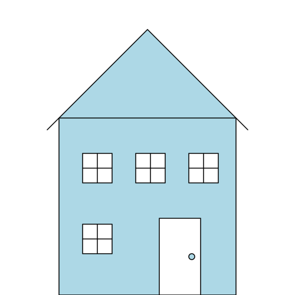
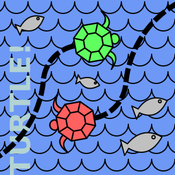

# SvgPathTurtle (alpha)

**Create complex SVG `path` elements using turtle graphics, but with true arcs and bezier curves.**


Examples below.  Full docs [here](DOCUMENTATION.md).

<details><summary>FAQ</summary>

> **What does it do?**
> * It creates the SVG path data for your `d` attributes, by executing your "turtle program"
> * An included compositor can merge those into your SVG file, allowing
>    for sensible deployment
>
> **Can turtle paths coexist with other SVG elements?**
> * Yes! SvgPathTurtle only targets the specific `path` elements you choose
> * All other elements (including other `path` elements) are unaffected
> * For instance, the "two turtles" image (below) combines non-turtle elements
>    like text with multiple turtle paths, each stroked and filled differently.
>
> **Is SvgPathTurtle more powerful than a normal turtle drawing language?**
> * Yes, because it uses true SVG curves (such as `a`, `q`, `c`)
> * Scaling is infinite, because curves are not approximations
> * User defined commands allow for very complex creations
>     (see examples below)
> * Also:
>   * Define shapes
>   * Rotate, scale, and place them
>   * Place copies
>   * Even reflect them!
>
> **Why use SvgPathTurtle?**
> * It calculates most x and y coordinates for you
> * Complex drawings are sometimes easier than with an authoring tool
> * It's fun!

</details>

## Examples (click for code)

| Simple | Advanced 
| ------ | -------
| Octagon | Flower
| [](#octagon) | [](#flower)
| Hearts | Wiggly Hilbert
| [](#hearts) | [](#wiggly-hilbert-curve)
| House | Compositing
| [](#house) | [](#compositing)

### Octagon


A simple for-loop.

```mysql
M 200 130
for 8 { f 100 r 45 }
z
```

<details><summary>Code Notes</summary>

> `f` = move forward, drawing a line
> 
> `r` = rotate right
> 
> `M` and `z` are same as SVG: moveto absolute, and close path

</details>

Resultant SVG attribute value is largely optimized:

```
M200 130L300 130L370.71 200.71L370.71 300.71L300 371.42L200 371.42L129.29 300.71L129.29 200.71L200 130Z
```

> <details><summary>Or use pretty-print to get a more readable version, for debugging</summary>
> 
> ```
>   M 200 130
>   L 300 130
>   L 370.71 200.71
>   L 370.71 300.71
>   L 300 371.42
>   L 200 371.42
>   L 129.29 300.71
>   L 129.29 200.71
>   L 200 130
>   Z
> ```
>
> </details>

### Hearts


<details><summary>Code Notes</summary>

* This uses `stamp` from the included `library.svgt` import file,
  which places a drawing at the turtle's current position and orientation.
* It also uses `push` and `pop`, which save and restore the turtle's position.
  This allows it to "throw" multiple hearts from a center point.

</details>


```mysql
import 'library.svgt'

def heart(width)
{
  radius = (width/4)
  bottom = (width * .7)

  # first hump
  d -70
  a radius 170

  # save position, to mirror on left side
  x = turtle.x
  y = turtle.y

  # down to the bottom of the heart
  Q 0 bottom 150

  r 60

  # back up to saved point, mirrored across origin
  Q -x y -100 

  # second hump, returning to origin
  a radius 170
}

def throw_heart(angle distance size)
{
  push
    d angle
    j distance
    r 90

    stamp { heart size }
  pop
}

# main loop
M 250 250
for angle = 0..15..359
  throw_heart angle 150 (5 + angle/7)
```

### House


This may be a clumsy house, but it shows how to create a scene in a
directed way.
* Define specific shapes and place multiple copies.
* Control fill placement by controlling winding.
* Ensure angled lines coincide with shape edges.

```mysql
import 'library.svgt'

# Rectangles of opposite winding - rect_r is used first, and defines
# what will be filled.  rect_l then becomes the no-fill areas (windows
# and door).
def rect_r(w h) { push for 2 { f w r 90 f h r 90 } z pop }
def rect_l(w h) { push r 90 for 2 { f h l 90 f w l 90 } z pop }

def window()
{
  # frame
  rect_l 50 50

  # bars
  push j 25 r 90 line 50 pop
  push r 90 j 25 l 90 line 50 pop

  z
}

def door()
{
  # frame
  rect_l 70 130

  # handle
  j 55 r 90 j 65 stamp { circle 5 }
}

def house_frame()
{
  rect_r 300 300
}

# draws from top-left corner of house
def roof()
{
  # Notes: uses hypotenuse command 'hb' to precisely draw angled lines

  # eaves
  push r 135 hb 20 20 z pop
  push j 300 r 45 hb 20 20 z pop

  # attic
  r -45 hb 150 150 r 90 hb 150 150 z
}

M 100 200

stamp house_frame
stamp roof

# First floor

M 140 380 stamp window
j 130 l 90 j 10 r 90
stamp door

# Second floor

M 140 260 stamp window
j 90 stamp window
j 90 stamp window
```

### Flower


```mysql
import 'library.svgt'

def flower_petal()
{
  width = 10
  length = 30

  r -25
  q length -width 0
  a width 180
  q -length -width 25
}

M 250 250

npetals = 22
nrings = 4

for sz = 1..nrings
  for npetals
  {
    r (360/npetals)
    push
      # stem
      f (sz*15)

      # petal
      stomp (sz*.8) flower_petal
    pop
  }
```

### Wiggly Hilbert Curve


```mysql
def hilbert(level angle step veer)
{
  def wiggly_edge()
  {
    half=(step/2)

    # Determine the point we will Q to
    push up
      f half r veer
      x1 = turtle.x
      y1 = turtle.y
      a1 = turtle.dir
    pop

    # Now do the Q, and t for the second half
    r -veer Q x1 y1 a1 r -veer
    t half
    d a1
    r -veer
  }

  if level > 0
  {
    l angle
    hilbert (level - 1) -angle step -veer
    wiggly_edge
    r angle
    hilbert (level - 1) angle step veer
    wiggly_edge
    hilbert (level - 1) angle step -veer
    r angle
    wiggly_edge
    hilbert (level - 1) -angle step veer
    l angle
  }
}

levels = 4
size = 480
step = (size / (2**levels - 1))
veer = 20

M 10 (size + 10)

hilbert levels 90 step veer

```

### Compositing


Multiple turtle paths are composited into a single SVG file here, alongside
a non-turtle text element.

`icon.svg`
  * An SVG file with special links to the path data created by the turtle
  * Note: compositing is done by `svg_path_turtle_compositor`.  See 
    [Web Development](https://www.github.com/mmkns/svg-path-turtle/blob/main/DOCUMENTATION.md#web-development)
    for instructions.

Turtle files (programs):

[`parts`](icon/parts)
* A library of parts for the drawing, used by the files below

[`background`](icon/background)
* A sea of waves

[`turtle`](icon/turtle)
* One turtle (used twice in `icon.svg`)

[`trail`](icon/trail)
* One turtle trail (used twice in `icon.svg`)
* This is separate from `turtle` so it can be stroked with different attributes.

[`fish`](icon/fish)
* Several fish, leaping

For more info, examine the files in the `icon/` subdirectory.

---

That's all for now.
Full documentation is [here](DOCUMENTATION.md).
